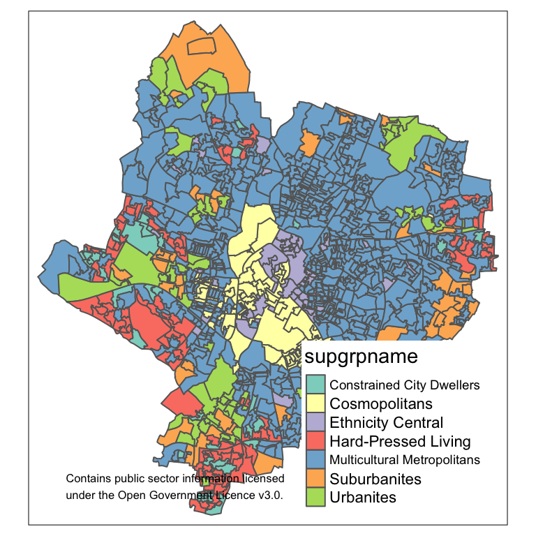

# About this module


## About this module

This module will provide you with the fundamental skills in

- basic programming in R
- reproducibility
- data wrangling
- data analysis

basis for

- *Geospatial Data Analysis*
- *Geospatial Databases and Information Retrieval*
- as well as *Geographical Visualisation*


## R programming language
    
One of the most widely used programming languages and an effective tool for *(geospatial)* data science

<div class="columns-2">

- data wrangling
- statistical analysis
- machine learning
- data visualisation and maps
- processing spatial data
- geographic information analysis

<br/><br/><br/>



</div>


## Schedule

<font size="4">

**Lectures**: Wednesdays, 09:00 - 10:00, Attenborough 205

**Practicals**: Thursdays, 15:00 - 17:00, David Wilson Library IT R1

### Topics

1. GIScience, Programming and Reproducibility
2. Data types
3. Data wrangling
4. Control structures and functions
5. Reproducibility 
6. Exploratory data analysis
7. Univariate analysis
8. Multivariate analysis
9. Unsupervised machine learning
10. Supervised machine learning

</font>


## Reference book

<div class="columns-2">

*Programming Skills for Data Science: Start Writing Code to Wrangle, Analyze, and Visualize Data with R*

Michael Freeman and Joel Ross

Addison-Wesley, 2019 

[See book webpage](https://www.pearson.com/us/higher-education/program/Freeman-Programming-Skills-for-Data-Science-Start-Writing-Code-to-Wrangle-Analyze-and-Visualize-Data-with-R/PGM2047488.html)

[See book repository](https://programming-for-data-science.github.io/)

<br/><br/>


{width=90%}

</div>


# R


## R

Created in 1992 by Ross Ihaka and Robert Gentleman at the University of Auckland, New Zealand

- Free, open-source implementation of *S*
    - statistical programming language 
    - Bell Labs

<br/>

- Functional programming language
- Supports (and commonly used as) procedural (i.e., imperative) programming
- Object-oriented
- Interpreted (not compiled)


## Interpreting values

When values and operations are inputted in the *Console*, the interpreter returns the results of its interpretation of the expression


```r
2
```

```
## [1] 2
```

```r
"String value"
```

```
## [1] "String value"
```

```r
# comments are ignored
```


## Basic types

R provides three core data types

- numeric 
    - both integer and real numbers
- character 
    - i.e., text, also called *strings*
- logical
    - `TRUE` or `FALSE`


## Numeric operators

R provides a series of basic numeric operators

<div class="packedtable">

|Operator|Meaning         |Example  |Output     |
|--------|----------------|---------|-----------|
|+       |Plus            |`5 + 2`  |7  |
|-       |Minus           |`5 - 2`  |3  |
|`*`     |Product         |`5 * 2`  |10  |
|/       |Division        |`5 / 2`  |2.5  |
|%/%     |Integer division|`5 %/% 2`|2|
|%%      |Module          |`5 %% 2` |1 |
|^       |Power           |`5^2`    |25    |

</div>
<br/>


```r
5 + 2
```

```
## [1] 7
```


## Logical operators


R provides a series of basic logical operators to test

<div class="packedtable">

|Operator|Meaning           |Example           |Output              |
|--------|------------------|------------------|--------------------|
|==      |Equal             |`5 == 2`          |FALSE          |
|!=      |Not equal         |`5 != 2`          |TRUE          |
|> (>=)  |Greater (or equal)|`5 > 2`           |TRUE           |
|< (<=)  |Less (or equal)   |`5 <= 2`          |FALSE          |
|!       |Not               |`!TRUE`           |FALSE           |
|&       |And               |`TRUE & FALSE`    |FALSE    |
|\|      |Or                |`TRUE | FALSE`    |TRUE    |

</div>
<br/>


```r
5 >= 2
```

```
## [1] TRUE
```


## Variables

Variables **store data** and can be defined 

- using an *identifier* (e.g., `a_variable`) 
- on the left of an *assignment operator* `<-`
- followed by the object to be linked to the identifier
- such as a *value* (e.g., `1`) 


```r
a_variable <- 1
```

The value of the variable can be invoked by simply specifying the **identifier**.


```r
a_variable
```

```
## [1] 1
```


## Algorithms and functions

*An* **algorithm** *or effective procedure is a mechanical rule, or automatic method, or programme for performing some mathematical operation* (Cutland, 1980).

A **program** is a specific set of instructions that implement an abstract algorithm.

The definition of an algorithm (and thus a program) can consist of one or more **function**s

- set of instructions that preform a task 
- possibly using an input, possibly returning an output value

Programming languages usually provide pre-defined functions that implement common algorithms (e.g., to find the square root of a number or to calculate a linear regression)


## Functions

Functions execute complex operations and can be invoked 

- specifying the *function name*
- the *arguments* (input values) between simple brackets
    - each *argument* corresponds to a *parameter*
    - sometimes the *parameter* name must be specified


```r
sqrt(2)
```

```
## [1] 1.414214
```

```r
round(1.414214, digits = 2)
```

```
## [1] 1.41
```


## Functions and variables

- functions can be used on the right side of `<-` 
- variables and functions can be used as *arguments*


```r
sqrt_of_two <- sqrt(2)
sqrt_of_two
```

```
## [1] 1.414214
```

```r
round(sqrt_of_two, digits = 2)
```

```
## [1] 1.41
```

```r
round(sqrt(2), digits = 2)
```

```
## [1] 1.41
```


## Naming

When creating an identifier for a variable or function

- R is a **case sensitive** language
    - UPPER and lower case are not the same
    - `a_variable` is different from `a_VARIABLE`
- names can include
    -  alphanumeric symbols
    - `.` and `_`
- names must start with
    - a letter


## Coding style

A *coding style* is a way of writing the code, including

- how variable and functions are named
    - lower case and `_`
- how spaces are used in the code
- which libraries are used


```r
# Bad
X<-round(sqrt(2),2)

#Good
sqrt_of_two <- sqrt(2) %>%
 round(digits = 2)
```

Study the [Tidyverse Style Guid](http://style.tidyverse.org/) and use it consistently!


## R libraries

Libraries are collections of functions and/or datasets.

- installed in R using the function `install.packages` 
- loaded using the function `library`
- every script needs to load all the library that it uses


```r
install.packages("tidyverse")
```

```r
library(tidyverse)
```

The meta-library [Tidyverse](https://www.tidyverse.org/) contains many libraries, including `stringr`.


## stringr

R provides some basic functions to manipulate strings, but the `stringr` library provides a more consistent and well-defined set


```r
str_length("Leicester")
```

```
## [1] 9
```

```r
str_detect("Leicester", "e")
```

```
## [1] TRUE
```

```r
str_replace_all("Leicester", "e", "x")
```

```
## [1] "Lxicxstxr"
```


## The pipe operator

The [Tidyverse](https://www.tidyverse.org/) also provide a clean and effective way of combining multiple manipulation steps

The pipe operator `%>%`

- takes the result from one function
- and passes it to the next function
- as the **first argument**
- that doesn't need to be included in the code anymore


## Pipe example
<center>
{width=100%}
</center>


## Pipe example

The two codes below are equivalent

- the first simply invokes the functions
- the second uses the pipe operator `%>%`


```r
round(sqrt(2), digits = 2)
```

```
## [1] 1.41
```


```r
sqrt(2) %>%
 round(digits = 2)
```

```
## [1] 1.41
```


# Summary


## Summary

An introduction to R

- Basic types
- Basic operators
- variables
- Libraries
- The pipe operator
- Coding style


## Practical session

In the practical session, we will see

- The R programming language
- Interpreting values
- Variables
- Basic types
- Tidyverse
- Coding style


## Next week

More complex data types

- Vectors
- Factors
- Matrices
- Arrays
- Lists
- Data Frames
