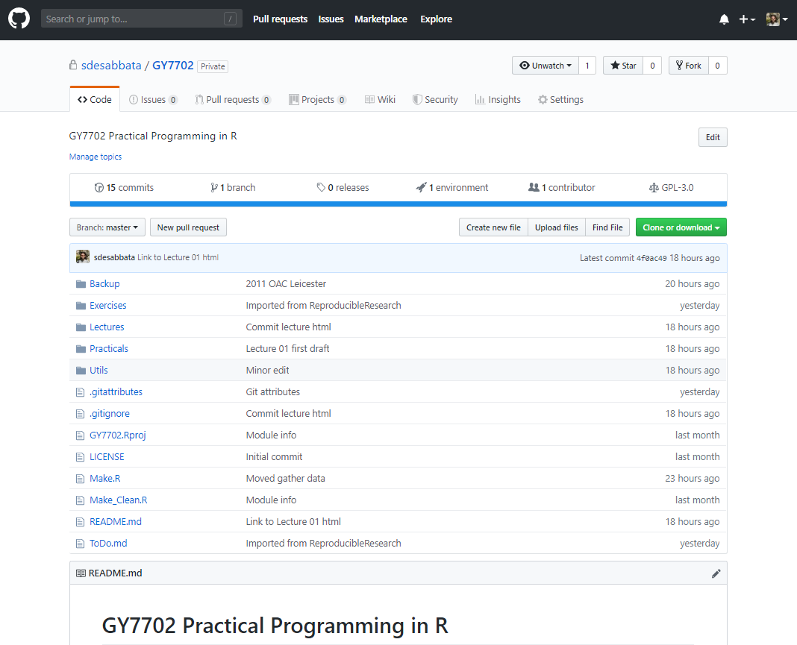

# Recap @ 301


## Previous lectures

Moving from programming to data science

- Basic types and variables
- The pipe operator
- Complex data types
- Data wrangling
    - Data selection
    - Data filtering
    - Data manipulation
    - Join operations
    - Table re-shaping
    - Read and write data


## Today

Reproducibility in (geographic) data science

- What is reproducible data analysis?
    - why is it important?
    - software engineering
    - practical principles
- Tools
    - Markdown
    - RMarkdown
    - Git

See also: [Christopher Gandrud, *Reproducible Research with R and R Studio*](https://www.crcpress.com/Reproducible-Research-with-R-and-R-Studio/Gandrud/p/book/9781498715379) also available [on GitHub](https://github.com/christophergandrud/Rep-Res-Book)


# Reproducibility


## Reproduciblity

In quantitative research, an analysis or project are considered to be **reproducible** if:

- *"the data and code used to make a finding are available and they are sufficient for an independent researcher to recreate the finding."* [Christopher Gandrud, *Reproducible Research with R and R Studio*](https://www.crcpress.com/Reproducible-Research-with-R-and-R-Studio/Gandrud/p/book/9781498715379)

That is becoming more and more important in science:

- as programming and scripting are becoming integral in most disciplines
- as the amount of data increases


## Why?

In **scientific research**:

- verificability of claims through replication
- incremental work, avoid duplication

For your **working practice**:

- better working practices
    - coding
    - project structure
    - versioning
- better teamwork
- higher impact (not just results, but code, data, etc.)


## Reproducibility and software engineering

Core aspects of **software engineering** are:

- project design
- software **readibility**
- testing
- **versioning**

As programming becomes integral to research, similar necessities arise among scientists and data analysts.


## Reproducibility and "big data"

There has been a lot of discussions about **"big data"**...

- volume, velocity, variety, ...

Beyond the hype of the moment, as the **amount** and **complexity** of data increases

- the time required to replicate an analysis using point-and-click software becomes unsustainable
- room for error increases

Workflow management software (e.g., ArcGIS ModelBuilder) is one answer, reproducible data analysis based on script languages like R is another.


## Reproducibility in GIScience

[Singleton *et al.*](https://www.tandfonline.com/doi/abs/10.1080/13658816.2015.1137579) have discussed the issue of reproducibility in GIScience, identifying the following best practices:

1. Data should be accessible within the public domain and available to researchers.
2. Software used should have open code and be scrutable.
3. Workflows should be public and link data, software, methods of analysis and presentation with discursive narrative
4. The peer review process and academic publishing should require submission of a workflow model and ideally open archiving of those materials necessary for
replication.
5. Where full reproducibility is not possible (commercial software or sensitive data) aim to adopt aspects attainable within circumstances


## Document everything

In order to be reproducible, every step of your project should be documented in detail

- data gathering
- data analysis
- results presentation

Well documented R scripts are and excellent way to document your project. 


## Future-proof formats

Complex formats (e.g., .docx, .xlsx, .shp, ArcGIS .mxd)

- can become obsolete
- are not always portable
- usually require proprietary software

Use the simplest format to **future-proof** your analysis.<br/>**Text files** are the most versatile

- data: .txt, .csv, .tsv
- analysis: R scrpts, python scripts
- write-up: LaTeX, Markdown, HTML


## Human-readable

Create code that can be **easily understandable** to someone outside your project, including yourself in six-month time!

- use a style guide (e.g. [tidyverse](http://style.tidyverse.org/)) consistently
- add a comment at the beginning of a file, including
    - date
    - contributors
    - other files the current file depends on
    - materials, sources and other references 
- add a comment before each code block, describing what the code does
- also add a comment before any line that could be ambiguous or particularly difficult or important


## Workflow

Relationships between files in a project are not simple:

- in which order are file executed?
- when to copy files from one folder to another, and where?

A common solution is using **make files**

- commonly written in *bash* on Linux systems
- they can be written in R, using commands like
    - *source* to execute R scripts
    - *system* to interact with the operative system


## Store and share

Reproducible data analysis is particularly important when working in teams, to share and communicate your work.

- [Dropbox](https://www.dropbox.com)
    - good option to work in teams, initially free
    - no versioning, branches
- [Git](https://git-scm.com)
    - free and opensource control system
    - great to work in teams and share your work publically
    - can be more difficult at first
    - [GitHub](https://github.com) public repositories are free, private ones are not
    - [GitLab](https://about.gitlab.com/) offers free private repositories


## This repository

My GitHub repository [GY7702](https://github.com/sdesabbata/GY7702) stores lectures and practical session materials for this module

<div class="img50">

{width=30%}

<center>
<font size="4">
<a href="https://github.com/sdesabbata/GY7702">https://github.com/sdesabbata/GY7702</a>
GitHub Page at <a href="https://sdesabbata.github.io/GY7702/">https://sdesabbata.github.io/GY7702/</a>
</font>
</center>

</div>


# RMarkdown


## Markdown

**Markdown** is a simple markup language

- allows to mark-up plain text 
- to specify more complex features (such as *italics text*)
- using a very simple [syntax](https://daringfireball.net/projects/markdown/syntax)

Markdown can be used in conjunction with numerous tools

- to produce HTML pages
- or even more complex formats (such as PDF)

These slides are written in Markdown


## Markdown example code

```
### This is a third level heading

Text can be specified as *italic* or **bold**

- and list can be created
    - very simply

1. also numbered lists
    1. [add a link like this](http://le.ac.uk)

|Tables |Can         |Be       |
|-------|------------|---------|
|a bit  |complicated |at first |
|but    |it gets     |easier   |
```


## Markdown example output

### This is a third level heading

Text can be specified as *italic* or **bold**

- and list can be created
    - very simply

1. also numbered lists
    1. [add a link like this](http://le.ac.uk)

|Tables |Can         |Be       |
|-------|------------|---------|
|a bit  |complicated |at first |
|but    |it gets     |easier   |


## RMarkdown example code

````
Let's write an example of **R** code including 

- a variable `a_variable`
- an assignment operation (i.e., `<-`)
- a mathematical operation (i.e., `+`)

```{r, echo=TRUE}
a_variable <- 0
a_variable <- a_variable + 1
a_variable <- a_variable + 1
a_variable <- a_variable + 1
a_variable
```
````


## Writing RMarkdown docs

**RMarkdown** documents contain both Markdown and R code. These files can be created in RStudio, and compiled to create an html page (like this document), a pdf, or a Microsoft Word document.

<center>
{width=80% style="border: 1px solid black"}
</center>


# Git


## What's git?

**Git** is a free and opensource version control system

- commonly used through a server
    - where a master copy of a project is kept
    - can also be used locally
- allows storing versions of a project
    - syncronisation
    - consistency
    - history
    - multiple branches


## How git works

A series of snapshots

- each commit is a snapshot of all files
- if no change to a file, link to previous commit
- all history stored locally

<center>
{width=80%}

<br/>
<font size="4">
<a href="https://git-scm.com/book/en/v2/Getting-Started-What-is-Git%3F">by Scott Chacon and Ben Straub</a>, licensed under <a href="https://creativecommons.org/licenses/by-nc-sa/3.0/">CC BY-NC-SA 3.0</a>
</font>
</center>


## Three stages

When working with a git repository

- first checkout the latest version
- select the edits to stage
- commit what has been staged in a permanent snapshot

<center>
{width=60%}

<br/>
<font size="4">
<a href="https://git-scm.com/book/en/v2/Getting-Started-What-is-Git%3F">by Scott Chacon and Ben Straub</a>, licensed under <a href="https://creativecommons.org/licenses/by-nc-sa/3.0/">CC BY-NC-SA 3.0</a>
</font>
</center>


## Basic git commands

- `git clone`
    - copy a repository from a server
- `git fetch`
    - get the latest version from a branch
- `git pull`
    - incorporate changes from a remote repository
- `git add`
    - stage new files
- `git commit`
    - create a commit
- `git push`
    - upload commits to a remote repository


## Git and RStudio

RStudio includes a git plug-in

- clone R projects from repositories
- stage and commit changes
- push and pull changes

<center>
{width=70% style="border: 1px solid black"}
</center>


# Summary


## Summary

Reproducibility in (geographic) data science

- What is reproducible data analysis?
    - why is it important?
    - software engineering
    - practical principles
- Tools
    - Markdown
    - RMarkdown
    - Git


## Practical session

In the practical session, we will see

- Markdown
- Git
- Examples of reproducible data analysis


## Next week

Exploratory data analysis
