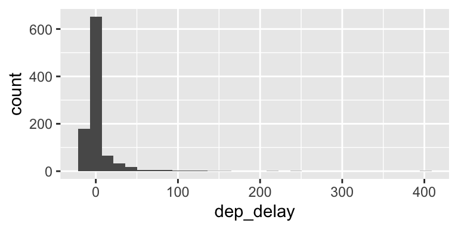

<style type="text/css">
.small_r_all pre{
  font-size: 16px;
  line-height: 18px;
}
.small_r_output pre:not(.prettyprint){
  font-size: 16px;
  line-height: 18px;
}
.verysmall_r_output pre:not(.prettyprint){
  font-size: 12px;
  line-height: 14px;
}
</style>


# Data transformations


## Recap

**Prev**: Correlation

- Pearson’s r
- Spearman’s rho
- Kendall’s tau
- Pairs plot

**Now**: Data transformations

- Z-scores
- Logarithmic transformations


## Libraries and data


```r
library(tidyverse)
library(magrittr)  
library(nycflights13)

flights_nov_20 <- nycflights13::flights %>%
  filter(!is.na(dep_delay), !is.na(arr_delay), month == 11, day ==20) 
```


## Z-scores

*Z-scores* transform the values as relative to the distribution mean and standard deviation

<div class="columns-2">


```r
flights_nov_20 %>%
  ggplot(aes(x = dep_delay)) +
  geom_histogram()
```


```r
flights_nov_20 %>%
  mutate(
    dep_delay_zscore = 
      scale(dep_delay)
  ) %>%
  ggplot(
    aes(x = dep_delay_zscore)
  ) +
  geom_histogram()
```

<br/>


</div>


## Log transformation

*Logarithmic* transformations (e.g., `log` and `log10`) are useful to *"un-skew"* variables, but only possible on values `> 0`

<div class="columns-2">


```r
flights_nov_20 %>%
  filter(dep_delay > 0) %>%
  ggplot(aes(x = dep_delay)) +
  geom_histogram()
```


```r
flights_nov_20 %>%
  filter(dep_delay > 0) %>%
  mutate(
    dep_delay_log = 
      log(dep_delay)
  ) %>%
  ggplot(
    aes(x = dep_delay_log)) + 
  geom_histogram()
```

<br/>


</div>


## Inverse hyperbolic sine


*Inverse hyperbolic sine* (`asinh`) transformations are useful to *"un-skew"* variables, similar to logarithmic transformations, work on all values

<div class="columns-2">


```r
flights_nov_20 %>%
  ggplot(aes(x = dep_delay)) +
  geom_histogram()
```


```r
flights_nov_20 %>%
  mutate(
    dep_delay_ihs = 
      asinh(dep_delay)
  ) %>%
  ggplot(
    aes(x = dep_delay_ihs)) + 
  geom_histogram()
```

<br/>




</div>


## Summary

Data transformations

- Z-scores
- Logarithmic transformations

**Next**: Practical session

- Comparing means
- Correlation
