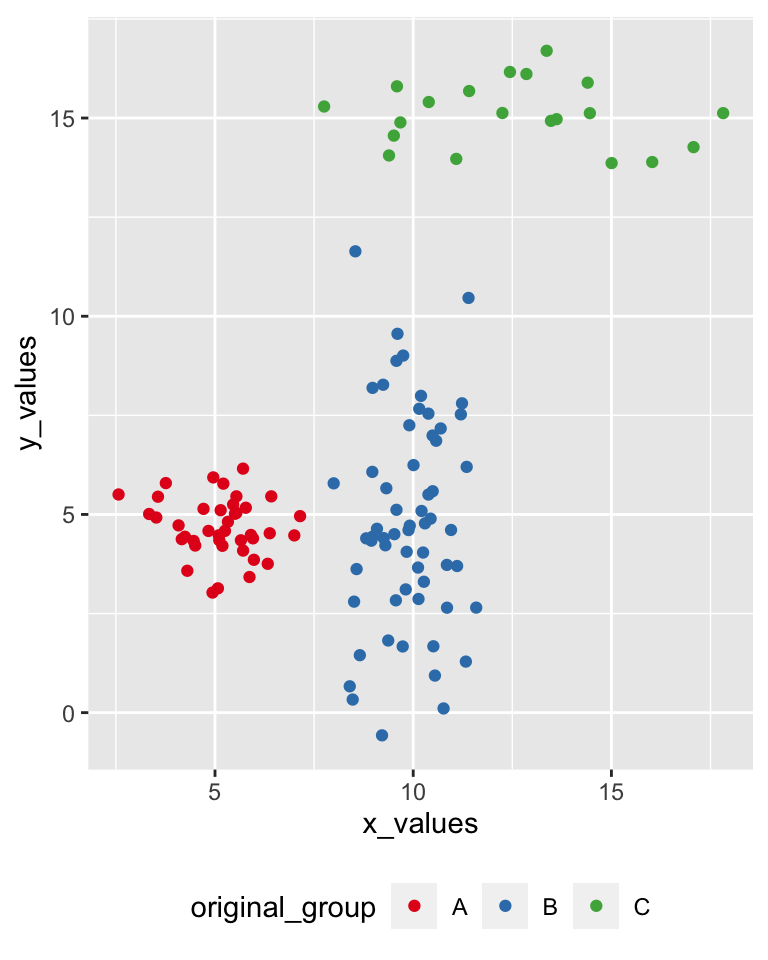
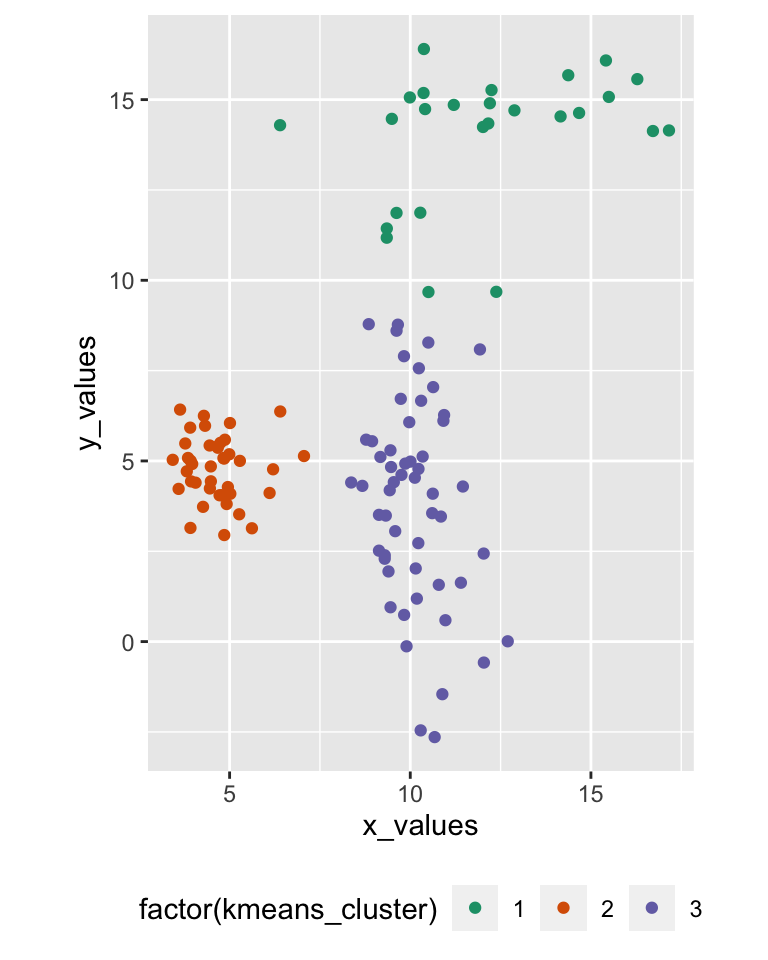
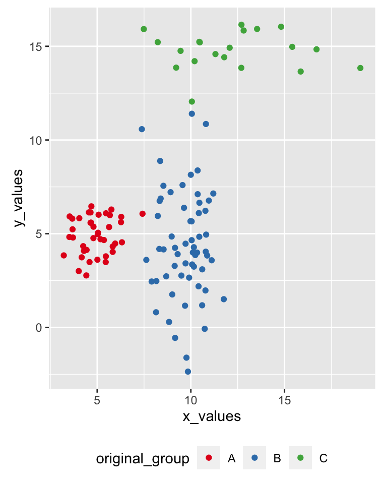
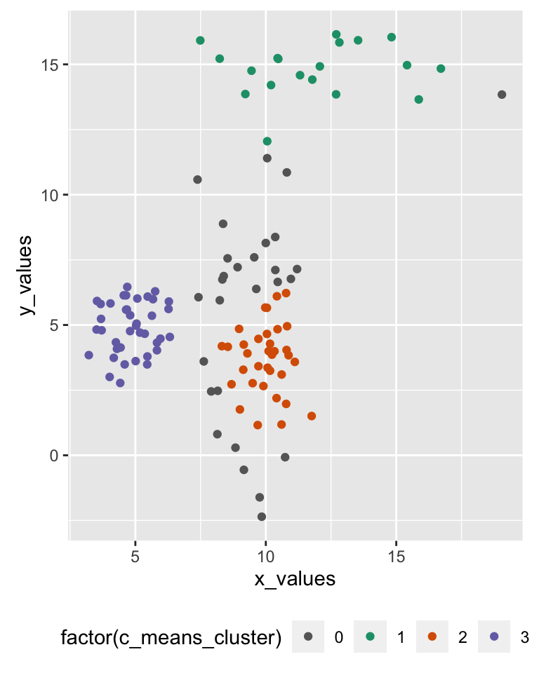

# Centroid-based clustering


## Recap

**Prev**: Machine Learning

- What's Machine Learning?
- Types
- Limitations

**Now**: Centroid-based clustering

- K-means
- Fuzzy c-means
- Geodemographic classification

- Hierarchical
- Mixed 
- Density-based


## Clustering task

*"Clustering is an unsupervised machine learning task that automatically divides the data into* ***clusters*** *, or groups of similar items"*. (Lantz, 2019)

Methods:

- Centroid-based 
    - k-means
    - fuzzy c-means
- Hierarchical
- Mixed 
    - bootstrap aggregating
- Density-based
    - DBSCAN


## Example


```r
data_to_cluster <- data.frame(
  x_values = c(rnorm(40, 5, 1), rnorm(60, 10, 1), rnorm(20, 12, 3)),
  y_values = c(rnorm(40, 5, 1), rnorm(60, 5, 3), rnorm(20, 15, 1)),
  original_group = c(rep("A", 40), rep("B", 60), rep("C", 20)) )
```

<center>

</center>

## k-means

k-mean clusters `n` observations in `k` clusters, minimising the within-cluster sum of squares (WCSS)

<font size="4">	
**Algorithm**: `k` observations a randomly selected as initial centroids, then repeat

- **assignment step**: observations are assigned to the closest centroids
- **update step**: calculate means for each cluster to use as new the centroid

until centroids don't change anymore, the algorithm has **converged**
</font>


```r
kmeans_found_clusters <- data_to_cluster %>%
  select(x_values, y_values) %>%
  kmeans(centers=3, iter.max=50)

data_to_cluster <- data_to_cluster %>%
  add_column(kmeans_cluster = kmeans_found_clusters$cluster)
```

## K-means result

<div class="columns-2">





</div>

## Fuzzy c-means

Fuzzy c-means is similar to k-means but allows for *"fuzzy*" membership to clusters

Each observation is assigned with a value per each cluster

- usually from `0` to `1`
- indicates how well the observation fits within the cluster
- i.e., based on the distance from the centroid


```r
library(e1071)

cmeans_result <- data_to_cluster %>%
  select(x_values, y_values) %>%
  cmeans(centers=3, iter.max=50)

data_to_cluster <- data_to_cluster %>%
  add_column(c_means_assigned_cluster = cmeans_result$cluster)
```

## Fuzzy c-means

A *"crisp"* classification can be created by picking the highest membership value.

- that also allows to set a membership threshold (e.g., `0.75`)
- leaving some observations without a cluster


```r
data_to_cluster <- data_to_cluster %>%
  add_column(
    c_means_membership = apply(cmeans_result$membership, 1, max)
  ) %>%
  mutate(
    c_means_cluster = ifelse(
      c_means_membership > 0.75, 
      c_means_assigned_cluster, 
      0
    )
  )
```

## Fuzzy c-means result

<div class="columns-2">





</div>


## Geodemographic classifications

In GIScience, the clustering is commonly used to create *geodemographic classifications* such as the 2011 Output Area Classification (Gale *et al.*, 2016)

- initial set of 167 prospective variables from the United Kingdom Census 2011
    - 86 were removed, 
    - 41 were retained as they are
    - 40 were combined
    - final set of 60 variables. 
- k-means clustering approach to create 
    - 8 supergroups
    - 26 groups
    - 76 subgroups. 


## Summary

Centroid-based clustering

- K-means
- Fuzzy c-means
- Geodemographic classification

**Next**: Hierarchical and density-based clustering

- Hierarchical
- Mixed 
- Density-based
