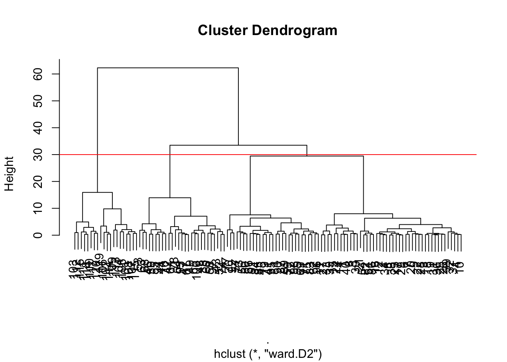
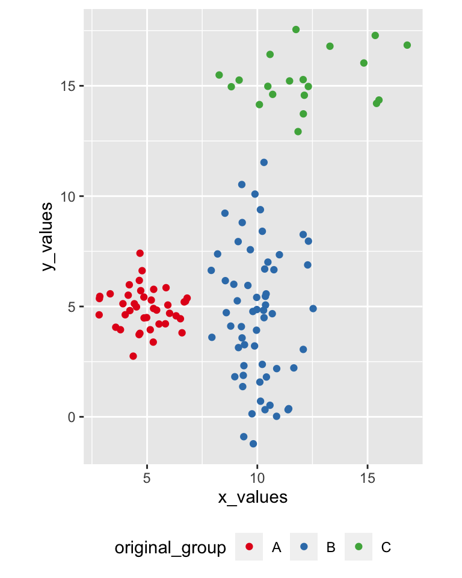
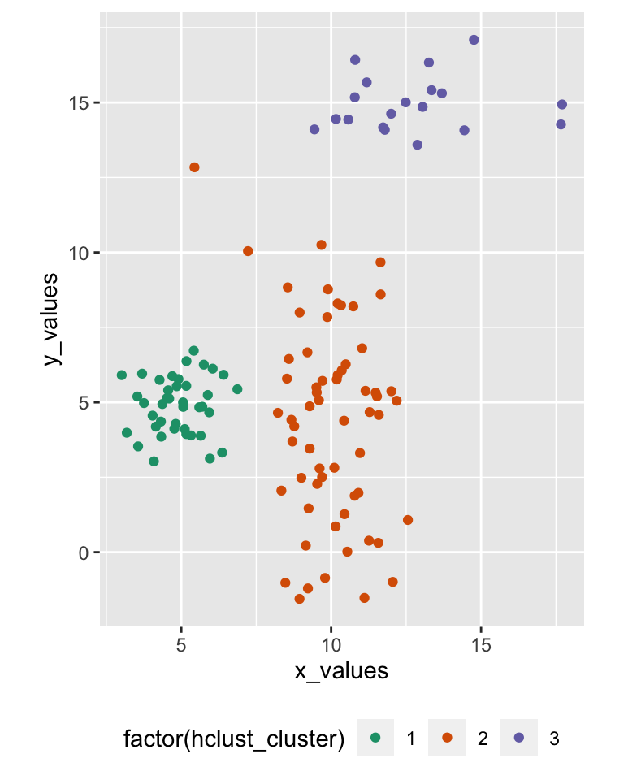
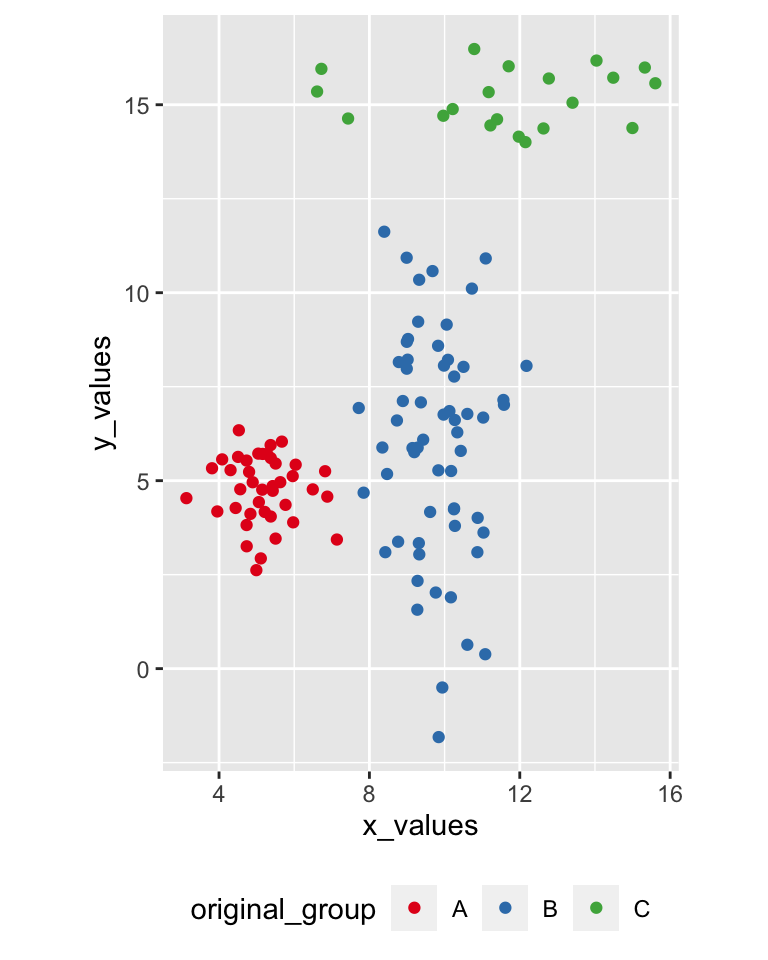
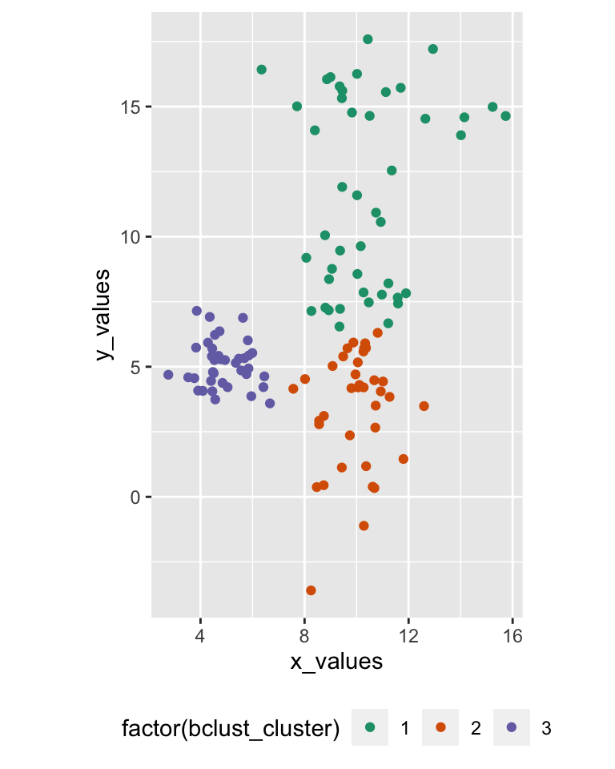
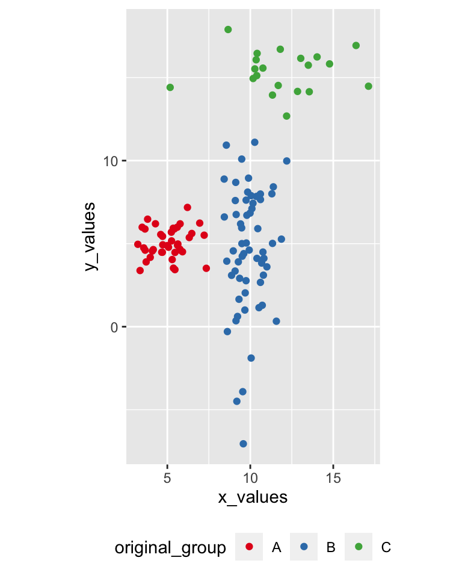
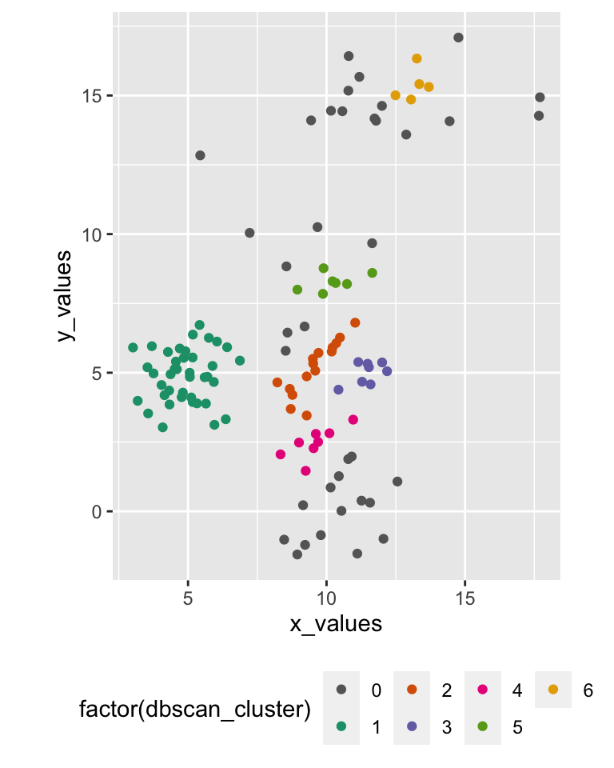

# Hierarchical and density-based clustering


## Recap

**Prev**: Centroid-based clustering

- K-means
- Fuzzy c-means
- Geodemographic classification

**Now**: Hierarchical and density-based clustering

- Hierarchical
- Mixed 
- Density-based


## Libraries


```r
library(tidyverse)
```

```
## ── Attaching packages ───────────────────────────────────────────────────────────────────────────────────────────────────────────────── tidyverse 1.3.0 ──
```

```
## ✓ ggplot2 3.3.2     ✓ purrr   0.3.4
## ✓ tibble  3.0.3     ✓ dplyr   1.0.0
## ✓ tidyr   1.1.0     ✓ stringr 1.4.0
## ✓ readr   1.3.1     ✓ forcats 0.5.0
```

```
## ── Conflicts ──────────────────────────────────────────────────────────────────────────────────────────────────────────────────── tidyverse_conflicts() ──
## x dplyr::filter() masks stats::filter()
## x dplyr::lag()    masks stats::lag()
```

```r
library(e1071)
library(dbscan)
```

```
## Warning: package 'dbscan' was built under R version 4.0.2
```


## Example


```r
data_to_cluster <- data.frame(
  x_values = c(rnorm(40, 5, 1), rnorm(60, 10, 1), rnorm(20, 12, 3)),
  y_values = c(rnorm(40, 5, 1), rnorm(60, 5, 3), rnorm(20, 15, 1)),
  original_group = c(rep("A", 40), rep("B", 60), rep("C", 20)) )
```


## Hierarchical clustering

<font size="4">	
**Algorithm**: each object is initialised as, then repeat

- join the two most similar clusters based on a distance-based metric
- e.g., Ward's (1963) approach is based on variance

until only one single cluster is achieved
</font>


```r
hclust_result <- data_to_cluster %>%
  select(x_values, y_values) %>%
  dist(method="euclidean") %>%
  hclust(method="ward.D2")

data_to_cluster <- data_to_cluster %>%
  add_column(hclust_cluster = cutree(hclust_result, k=3))
```

## Clustering tree

This approach generates a clustering tree (dendrogram), which can then be *"cut"* at the desired height


```r
plot(hclust_result) + abline(h = 30, col = "red")
```



```
## integer(0)
```

## Hierarchical clustering result

<div class="columns-2">





</div>


## Bagged clustering

Bootstrap aggregating (*b-agg-ed*) clustering approach (Leisch, 1999)

- first k-means on samples
- then a hierarchical clustering of the centroids generated through the samples


```r
bclust_result <- data_to_cluster %>%
  select(x_values, y_values) %>%
  bclust(hclust.method="ward.D2", resample = TRUE)

data_to_cluster <- data_to_cluster %>%
  add_column(bclust_cluster = clusters.bclust(bclust_result, 3))
```

## Bagged clustering result

<div class="columns-2">





</div>


## Density based clustering

DBSCAN (*"density-based spatial clustering of applications with noise"*) starts from an unclustered point and proceeds by aggregating its neighbours to the same cluster, as long as they are within a certain distance. (Ester *et al*, 1996)


```r
dbscan_result <- data_to_cluster %>%
  select(x_values, y_values) %>%
   dbscan(eps = 1, minPts = 5)

data_to_cluster <- data_to_cluster %>%
  add_column(dbscan_cluster = dbscan_result$cluster)
```

## DBSCAN result

<div class="columns-2">





</div>


## Summary

Hierarchical and density-based clustering

- Hierarchical
- Mixed 
- Density-based

**Next**: Practical session

- Geodemographic classification
