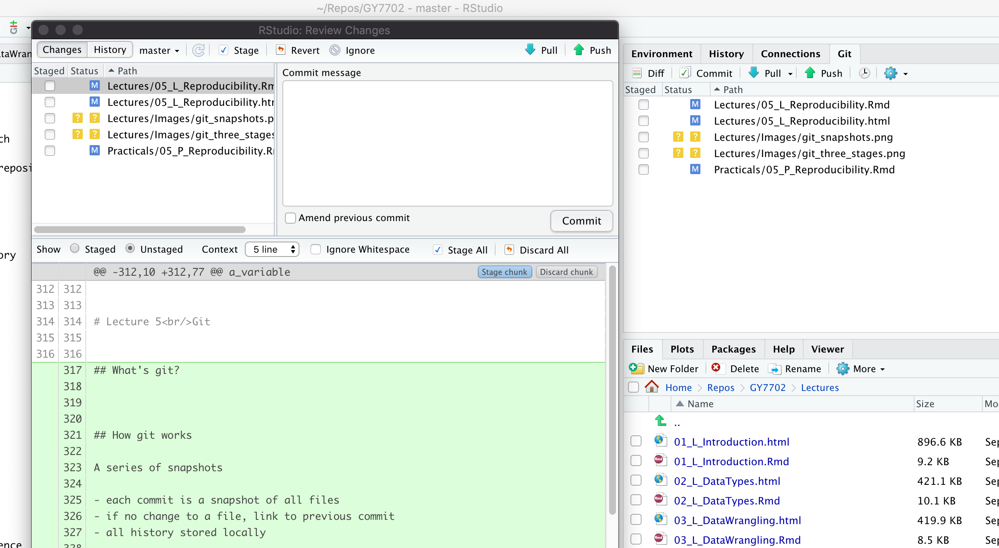

```{r setup, include=FALSE}
knitr::opts_chunk$set(echo = FALSE)
knitr::opts_knit$set(root.dir = Sys.getenv("GRANOLARR_HOME"))
rm(list = ls())
```


# Git


## Recap

RMarkdown

- Markdown
- RMarkdown

**Next**: Git and Docker

- Git operations
- Git and RStudio
- Docker


## What's git?

**Git** is a free and opensource version control system

- commonly used through a server
    - where a master copy of a project is kept
    - can also be used locally
- allows storing versions of a project
    - syncronisation
    - consistency
    - history
    - multiple branches


## How git works

A series of snapshots

- each commit is a snapshot of all files
- if no change to a file, link to previous commit
- all history stored locally

<center>
{width=80%}

<br/>
<font size="4">
<a href="https://git-scm.com/book/en/v2/Getting-Started-What-is-Git%3F">by Scott Chacon and Ben Straub</a>, licensed under <a href="https://creativecommons.org/licenses/by-nc-sa/3.0/">CC BY-NC-SA 3.0</a>
</font>
</center>


## Three stages

When working with a git repository

- first checkout the latest version
- select the edits to stage
- commit what has been staged in a permanent snapshot

<center>
{width=60%}

<br/>
<font size="4">
<a href="https://git-scm.com/book/en/v2/Getting-Started-What-is-Git%3F">by Scott Chacon and Ben Straub</a>, licensed under <a href="https://creativecommons.org/licenses/by-nc-sa/3.0/">CC BY-NC-SA 3.0</a>
</font>
</center>


## Basic git commands

- `git clone`
    - copy a repository from a server
- `git fetch`
    - get the latest version from a branch
- `git pull`
    - incorporate changes from a remote repository
- `git add`
    - stage new files
- `git commit`
    - create a commit
- `git push`
    - upload commits to a remote repository


## Git and RStudio

RStudio includes a git plug-in

- clone R projects from repositories
- stage and commit changes
- push and pull changes

<center>
{width=70% style="border: 1px solid black"}
</center>


## What's Docker?


Docker allows to encapsulate and share computational environments

- Similar to virtual machines
  - simulates a computer
- Lightweight
  - doesn't simulate an entire system
  - only the *"user space"* is simulated


:::::: {.cols data-latex=""}
::: {.col data-latex="{0.5\textwidth}"}

<br/><br/>
Images from: [Get started with Docker](https://docs.docker.com/get-docker/)
  
:::
::: {.col style="width: 50%;" data-latex="{0.5\textwidth}"}


<br/><br/>


:::
::::::


## Virtual machines

:::::: {.cols data-latex=""}
::: {.col style="width: 100%;" data-latex="{0.5\textwidth}"}

Virtual machines software (e.g., VMWare) simulate a computer on top of your operative system

- allows **virtual machine** to access physical resources (e.g., disk, keyboard) of a **host**
- allows to run full operative systems
- e.g., run a full Windows virtual machine on a Mac host
- have been around since the 1970s
- can be *heavy* to run

:::
::: {.col style="width: 80%; text-align: right;" data-latex="{0.5\textwidth}"}


Image from:<br/>[Get started with Docker](https://docs.docker.com/get-docker/)
:::
::::::


## Docker containers

:::::: {.cols data-latex=""}
::: {.col style="width: 100%;" data-latex="{0.5\textwidth}"}

Docker runs *containers*

- developed for flexible deployment of (web) services
  - compartimentalised
  - lightweight
  - (frequently) transient
- **kernel** is not simulated
  - kernels are the bulk of operative systems
  - containers share host's kernel
  - can also share binaries and libraries

:::
::: {.col style="width: 80%; text-align: right;" data-latex="{0.5\textwidth}"}


Image from:<br/>[Get started with Docker](https://docs.docker.com/get-docker/)
:::

::::::


## Docker and reproducibility

Why are dockers useful for reproducibility?

One of the key issues of reproducing a study is replicating the computational environment used

- e.g., all the libraries in their correct version 

Creating a Docker image (from which a container is instantiated)

- defined using a [*Dokerfile*](https://docs.docker.com/engine/reference/builder/)
- requires to list a full system configuration
  - version of programming language, libraries, etc
- once created / defined
  - other researchers or developers can run your script **in the exact same computational environment**


## granolarr Dockerfile

```{}
# Base image https://hub.docker.com/r/rocker/ml
FROM rocker/geospatial:4.0.2

# create an R user
ENV USER rstudio

## Install additional required R libraries
COPY ./DockerConfig/Requirements.R /tmp/Requirements.R
RUN Rscript /tmp/Requirements.R

## Install additional required TeX libraries
RUN tlmgr install amsmath
RUN tlmgr install latex-amsmath-dev
RUN tlmgr install iftex
RUN tlmgr install euenc
RUN tlmgr install fontspec
```

[... continues]


## Summary

Git

- Git operations
- Git and RStudio

**Next**: Practical

- Reproducibile data analysis
- RMarkdown
- Git

```{r cleanup, include=FALSE}
rm(list = ls())
```